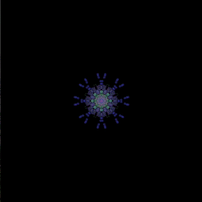

# Your Brain on Rugs

This is a side project I've been working on that uses the NeuroSky MindWave Mobile to create weird abstract art visualisations.

## How it works

The MindWave transmits a dozen or so different readings every second. These are based on raw EEG readings. These are used to power different parts of the the visualisation - for example, the overall saturation of each brush stroke or the xy coordinates of a brush.



## Getting Started/Prerequisites

You will need:

* [MindWave Mobile](https://store.neurosky.com/) - A cheap little EEG headset by NeuroSky.
* [ThinkGear Connector (v4.1.8)](http://developer.neurosky.com/docs/doku.php?id=thinkgear_connector_tgc) You will also need the ThinkGear Connector running in the background whenever you want to connect to the MindWave.

If you don't have either of these things, there is a sample set of brain data that you can use for testing or experiments.


## Setup

Download and run

```
npm install

```

## Running the project (connecting to a MindWave)

Setup your MindWave, and make sure the ThinkGear Connector software is running in the background. Connect to it by Running

```
node server.js
```

Compile and launch the visualisations by runnning

```
npm run start
```

## Running the project (without a MindWave, using sample data)

If you don't have a MindWave and just want to see an example of the visualisations, you can run the mock brain server.

```
node mock-brain.js
```

Then, compile and launch the visualisations if they aren't already running.


```
npm run start
```
